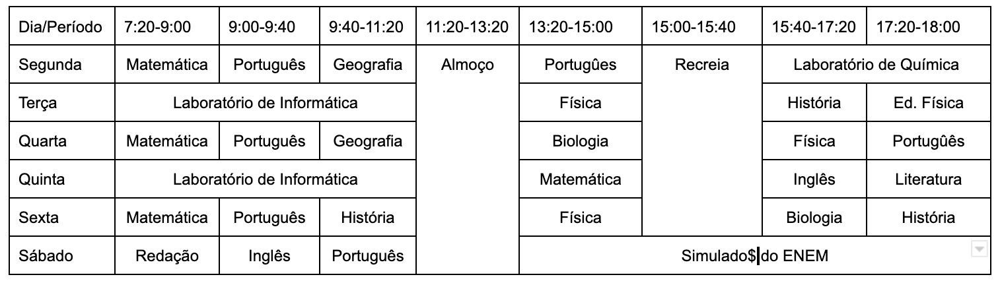

### Descrição:

O objetivo deste exercício é fazer praticar o uso das tags relacionadas a tabelas. Para isso você deverá criar a tabela abaixo usando apenas HTML:

A seguir siga as instruções:

1. Crie um novo arquivo HTML e salve-o com um nome adequado, como <mark>"minha-tabela.html"</mark>.
1. Use a tag `<html>` para definir o documento HTML.
1. Use a tag `<head>` para incluir uma tag title com o título da sua página de tabela.
1. Use a tag `<body>` para definir o corpo do seu documento.
1. Use a tag `<table>` para criar uma tabela.
1. Use a tag `<caption>` para adicionar uma legenda à sua tabela.
1. Use a tag `<thead>` para criar uma seção de cabeçalho da tabela.
1. Use a tag `<th>` para criar cabeçalhos de tabela para cada coluna da sua tabela.
1. Use a tag `<tbody>` para criar uma seção do corpo da tabela.
1. Use a tag `<tr>` para criar uma linha da tabela.
1. Use a tag `<td>` para adicionar dados a cada célula da sua tabela.
1. Repita os passos 11-12 para adicionar mais linhas de dados à sua tabela.
1. Use a tag `<tfoot>` para criar uma seção de rodapé da tabela, se necessário.

**Certifique-se de validar seu código HTML usando um validador como o [W3C Markup Validation Service](https://validator.w3.org/), para garantir que seu código esteja sem erros e bem formado**.

Gostou? Não esqueça de avaliar o exercício:

<a class="btn" href="https://forms.gle/scs1VxDDFSiMqAhe8" target="_blank"> Abra o formulário de avaliação</a>
