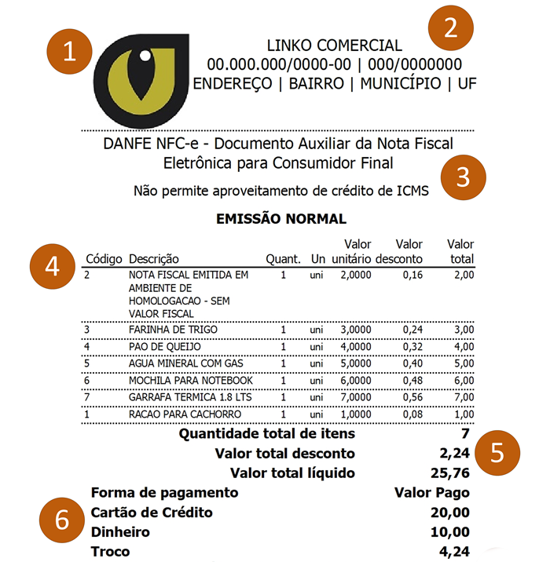

### Descrição:

O objetivo deste exercício é fazer praticar o uso das tags relacionadas a tabelas.

Para isso escolha você criará uma tabela que representa um Documento Auxiliar da Nota Fiscal Eletrônica para o Consumidor Final (DANFE NFC-E) simplificado, similar a figura abaixo:

<small>Fonte: <a href="https://cr.inf.br/blog/cupom-fiscal-eletronico-nfc-e-quais-informacoes-sao-impressas-na-danfe/" target="_blank">CR sistemas e web</a></small>

Vamos a explicação do DANFE NFC-e:

1. Logotipo
 - O DANFE NFC-e **pode** exibir o logotipo da empresa emitente, esta informação não é obrigatória, mas dá ao documento um visual bacana.
2. Dados da empresa emitente
 - Os dados da empresa que emitiu a NFC-e são obrigatórios.
 - Neste local você vai encontrar no topo a razão social da empresa.
 - Abaixo da razão social da empresa, às vezes pode aparecer também o nome fantasia, seguidos do CNPJ e a Inscrição Estadual.
 - Por fim, o endereço completo, bairro, município e a UF (Estado) da empresa emitente.
3. Título e informações gerais
 - Deve constar aqui as descrições:
    - DANFE NFC-e – Documento Auxiliar da Nota Fiscal Eletrônica para Consumidor Final
    - Não permite aproveitamento de crédito de ICMS, na segunda linha
    -  “EMISSÃO NORMAL”
4. Produtos
  - O quarto item do DANFE vai mostrar os produtos vendidos.
  - Aqui, algumas informações são obrigatórias:
    - Código do produto;
    - Descrição do produto;
    - Quantidade vendida;
    - Unidade de medida do produto (unidade, quilo, gramas, metros…);
    - Preço de venda unitário do produto;
    - Valor total (que é a quantidade multiplicada pelo preço unitário).
  - Opcionalmente, como consta na imagem, pode-se colocar o valor do desconto individual de cada produto.
5. Valores totais
  - Logo após os produtos devem ser exibidas algumas informações de totais:
    - a quantidade de itens;
    - o valor total do desconto;
    - e o valor total líquido do cupom.
6. Formas de pagamento
  - As formas de pagamento devem ser detalhadas no cupom.
    - Se o consumidor pagou em uma única forma (tudo em dinheiro, por exemplo), então apenas a forma de pagamento “Dinheiro” irá aparecer.
  - Além disso, se houve troco no ato da compra, este valor deve constar no DANFE também.
  
Dicas:

 - Use tabelas para os números 4, 5 e 6.
 - Faça sua tabela ter uma largura fixa para melhor sua aparência
 - Use CSS para alinhar os textos de acordo com sua necessidade

**Certifique-se de validar seu código HTML usando um validador como o [W3C Markup Validation Service](https://validator.w3.org/), para garantir que seu código esteja sem erros e bem formado**.

Gostou? Não esqueça de avaliar o exercício:

<a class="btn" href="https://forms.gle/scs1VxDDFSiMqAhe8" target="_blank"> Abra o formulário de avaliação</a>
