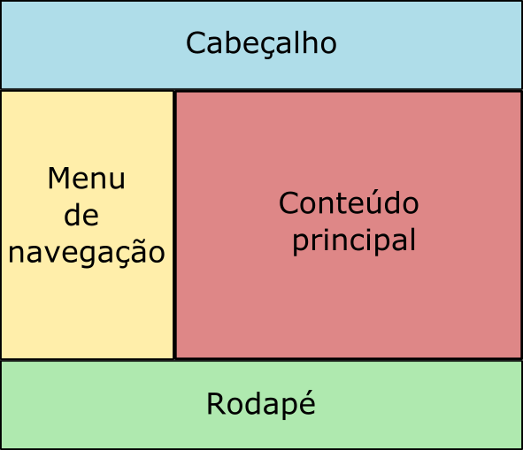

### Descrição:

Neste exercício, você criará um layout de duas colunas à moda antiga, usando a propriedade float no CSS. O objetivo é compreender como o float afeta o fluxo de elementos na página e como criar um layout básico usando essa técnica.

Instruções:

1. Crie um novo arquivo HTML chamado `layout.html`.
2. No documento HTML, defina a estrutura básica de uma página web, incluindo os elementos `<head>` e `<body>`.
3. Dentro do `<body>`, crie um cabeçalho simples com um título da página.
4. Crie uma barra lateral à esquerda ocupando 1/3 do espaço disponível e uma área de conteúdo à direita ocupando espaço restante.
  - Para posicionar a barra lateral e a área de conteúdo, utilize a propriedade float.
5. Aplique estilos CSS para estilizar a aparência do layout.    
  - Você pode definir larguras, alturas, cores de fundo,  margens, preenchimentos e bordas para cada coluna.
6. Certifique-se de que o conteúdo do cabeçalho, da barra lateral e da área de conteúdo esteja visível e formatado adequadamente.
7. Adicione um rodapé na parte inferior do layout, abaixo das colunas, mantendo o fluxo correto dos elementos.
8. Salve seus arquivos e abra o arquivo layout.html em um navegador para verificar o layout que você criou.

Dicas:

* Use a propriedade float com valores como `left` ou `right` para posicionar elementos lado a lado.
* Use as propriedades de CSS, como `width`, `height`, `background-color`, `margin`, `padding` e `borde`r, para estilizar suas colunas e elementos.
* Você pode usar elementos HTML como `<header>`, `<nav>`, `<aside>` e `<section>` para criar a estrutura semântica do layout.

Ao final do exercício o layout deve ficar parecido com isso:

Gostou? Não esqueça de avaliar o exercício:

<a class="btn" href="https://forms.gle/scs1VxDDFSiMqAhe8" target="_blank"> Abra o formulário de avaliação</a>
