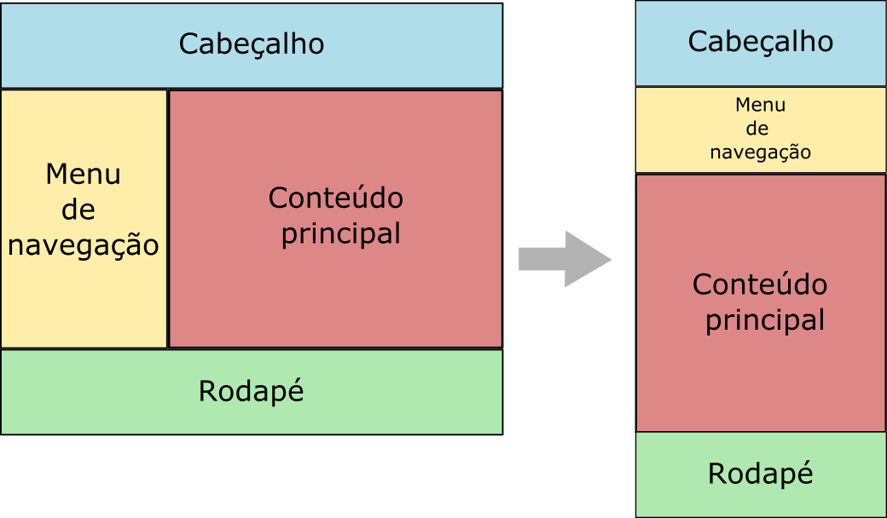

### Descrição:

Neste exercício, você irá criar um layout de duas colunas que se reorganiza em uma única coluna em telas menores, utilizando media queries. O objetivo é demonstrar como os elementos podem ser reorganizados para proporcionar uma melhor experiência de visualização em dispositivos com tamanhos de tela diferentes.

Instruções:

1. Crie um novo diretório chamado layout-reorganizado.
2. Dentro do diretório, crie um arquivo HTML chamado `index.html`.
3.  Altere o arquivo **src/index.html** e crie as seguintes seções:
    - Cabeçalho usando a tag `header`
    - Menu de navegação usando a tag `nav` 
    - Conteúdo principal usando a tag `main`
    - Rodapé usando a tag `footer`
1. Adicione um parágrafo de texto fictício em cada seção.
2. No arquivo **src/css/estilos.css**, aplique estilos para as seções que definem as cores de fundo, larguras, alturas e margens.
3. Em telas maiores que 600 pixels, o menu de navegação deve ocupar 30% da largura disponível e a o conteúdo principal o restante. Além disso, deve haver uma margem entre conteúdo da página e a janela do navegador.
4. Usando media queries, ajuste os estilos para que, quando a largura da tela for menor que 600 pixels, as seções se reorganizem em uma única coluna. 
    - Ajuste a largura e margem das seções para ocuparem a largura total da tela.
5.  Abra o arquivo **index.html** em um navegador para verificar o layout responsivo que você criou. Ajuste a largura da janela do navegador para ver a reorganização das seções.

Dicas:

* Use a propriedade `flexbox` para criar o layout de duas colunas.
* Use a media query `@media screen and (min-width: 600px)` para aplicar os estilos responsivos quando a largura da tela for menor que 700 pixels.
* Ajuste as larguras e margens das seções para ocuparem a largura total da tela em uma única coluna.

Ao final do exercício a página deverá ter duas possíveias aparências como mostra a figura abaixo:

Gostou? Não esqueça de avaliar o exercício:

<a class="btn" href="https://forms.gle/scs1VxDDFSiMqAhe8" target="_blank"> Abra o formulário de avaliação</a>
